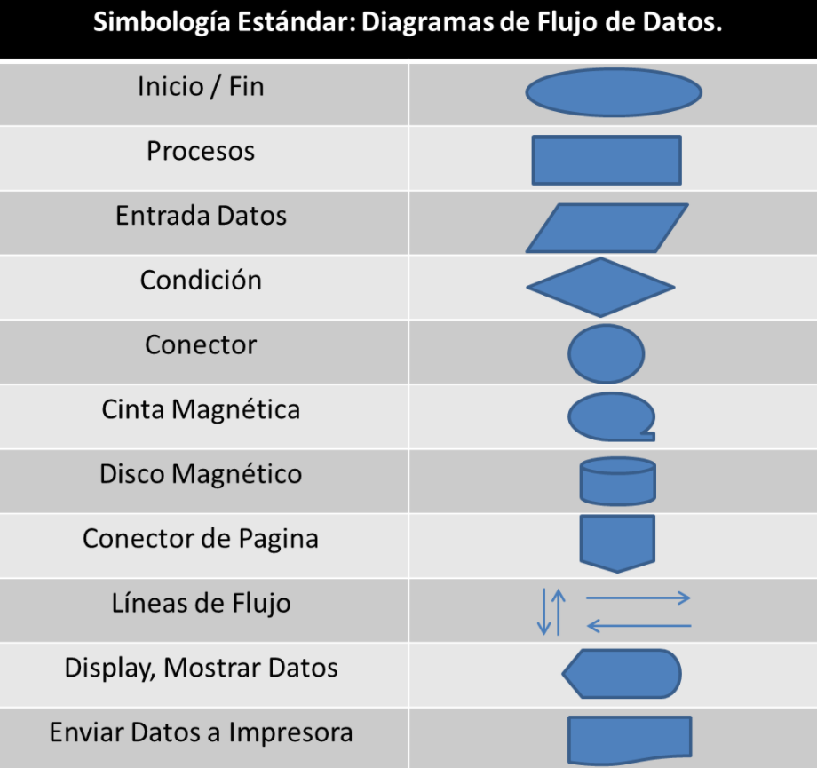

# Sesión 1.A - Algoritmos y Diagramas de Flujo

    Diplomado de Java - Módulo I
    Departamento de Diplomados y Extensión Profesional
    Centro de Investigación en Cómputo
    Instituto Politécnico Nacional

---

 Por [Alan Badillo Salas](https://github.com/dragonnomada)

---

## Introducción

En esta primera sesión aprenderemos el uso de los algoritmos y diagramas de flujos. Partiremos de los conceptos de **Información**, **Datos**, **Máquina** y **Programa**, para después formarnos una idea de **Algoritmos** y ponerla en práctica mediante los **Diagramas de Flujo**.

Esto nos permitirá establecer las bases para en próximas sesiones profundizar sobre los **Algoritmos de Búsqueda y Ordernamiento** y poder en el futuro minimizar el esfuerzo en la construcción de aplicaciones.

## Información y Datos

La naturaleza existe dentro de un oceano de información y datos. Podemos pensar a la información, cómo el mar dónde nada toda la realidad. Los datos por otra parte, podemos pensarlos como piezas de información abstraídas y representadas.

Por ejemplo, piense en una planta, la información que rodea la planta es infinita, desde su historia, composición, origen e incluso el futuro que le depara. Sin embargo, podemos extraer datos de la planta, los cuáles serán abstracciones de las observaciones y medidas que se realicen. Así, tendremos datos como su color, textura, medidas de ancho, alto, número y tamaño de hojas, tipo de planta, etc.

Entonces, podríamos decir, que la información es el universo de dónde se abstraen los datos. Y que los datos son piezas de información capturadas y representadas.

En la computación, se suele representar a los datos como valores numéricos o de texto. Ya que las computadoras son máquinas calculadoras, que por más potencia que tengan, están limitadas a arquitecturas primitivas que sólo pueden mover valores lógicos. Es decir, todas las posibles representaciones de información en una computadora, terminarán siendo datos binarios procesados por una unidad lógica (ALU) y una unidad central de procesamiento (CPU). El que los datos se almacenen o no, dependerá de la programación que tengan dichas máquinas computadoras.

Podemos pensar que las máquinas computadoras, son unidades de procesamiento, capaces de manipular y transformar datos en representaciones numéricas binarias. A esto le llamaremos *La Máquina Binaria*. Entonces, podemos decir, que las computadoras son máquinas binaras y nuestro objetivo será entender la naturaleza de dichas máquinas, para poder lograr una programación a través de procedimientos y algoritmos.

### Ejercicio 1.1

* Piensa en qué tipos de datos podemos obtener de un *Reloj Mecánico*.
* Piensa en qué tipos de datos podemos obtener de un *Cubo de Rubik*.

## Programas

Los programas son conjuntos instrucciones codificadas y empaquetadas, capaces de especificarle a la máquina las operaciones que necesitan ser realizadas para cumplir un objetivo.

Por ejemplo, piense en los siguientes programas y comandos, que guian a la máquina a cumplir una serie de objetivos.

    OBJETIVO: APAGAR LA MÁQUINA

    PROGRAMA: SHUTDOWN

    COMANDO: SHUTDOWN -h 5

En el ejemplo anterior, el programa `SHUTDOWN` recibe el parámetro `-h 5`, que le indica ejecutar un `HALT` o apagado dentro de `5` minutos. Entonces, este programa programará una señal de apagado, para que tras 5 minutos la máquina se apague.

Veamos un ejemplo más de otro programa.

    OBJETIVO: IMPRIMIR LA FECHA ACTUAL

    PROGRAMA: DATE

    COMANDO: DATE -I

En el ejemplo anterior, el programa `DATE` recibe el parámetro `-I` para mostrar la fecha actual. La máquina calculará la fecha actual basada en su reloj interno y la mostrará.

Como podemos ver, los programas empaquetan conjuntos de intrucciones codificadas, es decir, no podemos saber a ciencia cierta que hacen exactamente, sólo entender el tipo de entrada o parámetros que necesitan y la salida o efecto resultante.

Sin embargo, podemos generar programas, cuya lógica y código sean transparentes para nosotros, a través de algoritmos explícitos, los cuales codificaremos mediante algún lenguaje de programación, para finalmente compilarlos en programas, que extiendan las capacidades de la máquina y le permitan realizar nuevas tareas, para cumplir nuevos objetivos.

### Ejercicio 1.2

* Describe un programa que sea capaz de ser ejecutado por una máquina tipo *DRONE*.
* Describe un programa que extienda las capacidadesde de una máquina cafetera.
* Describe un programa que sea capaz de resolver el problema de cerrar y abrir una puerta mediante un código QR y una chapa digital.

## Algoritmos

Los **algoritmos** son deficiones de conjuntos de intrucciones ordenadas, que las máquinas serán capaces de entender, para dada una entrada de datos, producir una salida.

La entrada de datos dependerá del tipo datos y capacidades de la máquina. Generalmente serán datos *numéricos* y de *texto*, sin embargo, podríamos encontrar tipos de datos más sofisticados como imágenes, video y audio, aunque finalmente serán procesados como *bytes*, los cuáles son un tipo especial de números (se consideran datos binarios).

La salida podrá ser un resultado en la pantalla, ya sea un texto, una imágen, un video, un audio, un archivo o algún otro tipo de resultado soportado por la máquina, como un proceso o una señal. Esta salida generalmente producirá un efecto sobre la máquina, como cambiar su memoria física o virtual.

Los algoritmos se consideran esquemas de diseño lógico. Es decir, podemos establecer algoritmos para guiar la lógica de una máquina y cambiar su comportamiento para producir resultados (cálculos u operaciones) y cumplir objetivos específicos.

Se consideran algoritmos aquellos conjuntos de intrucciones bien definidas que tengan un principio y un fin, cuyo propósito sea resolver un objetivo. Al decir que las instrucciones son *bien definidas*, nos referimos al hecho de que la máquina podrá entender la instrucción sin ambigüedad en un tiempo finito.

Algunos ejemplos de **instrucciones bien definidas** para una máquina computadora serían las siguientes:

* Sumar dos valores
* Determinar sin un valor numérico es mayor a otro
* Almacenar un dato en la memoria temporal
* Almacenar un dato en la memoria permanente
* Leer el valor de un dispositivo

Algunos ejemplos de **instrucciones que no están bien definidas** para una máquina computadora serían las siguientes:

* Enviar un correo electrónico
* Decidir cuándo lloverá
* Ir a un centro comercial para realizar una compra
* Poner una taza de café
* Cerrar un agujero negro

Sin embargo, los algoritmos nos ayudarán a definir correctamente otras instrucciones, para completar instrucciones que no estén bien definidas. Siempre y cuando las instrucciones que comencemos a definir queden bien definidas. 

Por ejemplo, para resolver el problema de *Enviar un correo electrónico*, podremos determinar algunas instrucciones que permitan resolver este problema **paso a paso**.

    ALGORITMO: ENVIAR UN CORREO ELECTRÓNICO

    ENTRADA: 
    - LA DIRECCIÓN DE CORREO EMISORA
    - LA DIRECCIÓN DE CORREO DESTINATARIO
    - EL CONTENIDO DEL CORREO
    - EL PROTOCOLO DE ENVÍO DE CORREO

    SALIDA:
    - EL CÓDIGO DE ESTADO DE ENVIAR EL CORREO
    - LA CONFIRMACIÓN DE SI SE PUDO REALIZAR EL ENVÍO

    PROCEDIMIENTO:
    1. INICIO
    2. CREAR UNA CADENA QUE CODIFIQUE EL EMISOR, RECEPTOR Y CUERPO DEL CORREO EN EL PROTOCOLO ESTABLECIDO
    3. CREAR UN SOCKET DE COMUNICACIÓN CON EL SERVIDOR DE CORREO QUE RECIBA LA CADENA ANTERIOR
    4. RECUPERAR EL ESTADO DEL SERVIDOR DE CORREO
    5. DETERMINAR SI EL ESTADO DEL SERVIDOR ES EQUIVALENTE A HABER ENVIADO EL CORREO
    6. DEVOLVER EL CÓDIGO DE ESTADO Y SI SE PUDO ENVIAR EL CORREO
    7. FIN

Algunos algoritmos serán más sencillos que otros, dependiendo si la máquina es capaz de entender las instrucciones o no. En caso que la máquina no entienda las instrucciones de forma precisa, deberemos generar sub-algoritmos, para especificar los pasos a seguir en el sub-algoritmo y que la instrucción sea ahora completamente entendible por la máquina.

Veamos un ejemplo. En el siguiente algoritmo, se ordena una lista de números, sin embargo, se detecta un sub-algoritmo que tendríamos que resolver, para que nuestro algoritmo sea completamente entendible por la máquina, en cada instrucción.

    ALGORITMO: ORDENAR UNA LISTA DE NÚMEROS

    ENTRADA:
    - LA LISTA DE NÚMEROS (`LISTA_ENTRADA`)
    
    SALIDA:
    - LA LISTA DE NÚMEROS ORDENADA (`LISTA_SALIDA`)

    PROCEDIMIENTO:
    1. INICIO
    2. CREA UNA LISTA VACÍA LLAMADA `LISTA_SALIDA`
    3. ENCUENTRA EL ÍNDICE DEL ELEMENTO MENOR EN LA `LISTA_ENTRADA` (`ÍNDICE_MENOR`)
    4. RECUPERA EL VALOR DE `LISTA_ENTRADA` EN EL `ÍNDICE_MENOR` (`MENOR`)
    5. ELIMINA EL `ÍNDICE_MENOR` DE `LISTA_ENTRADA`
    6. AGREGA EL VALOR `MENOR` EN `LISTA_SALIDA` EN LA ÚLTIMA POSICIÓN
    7. SI `LISTA_ENTRADA` TIENE MÁS DE UN ELEMENTO, REPITE [PASO 3]
    8. DEVUELVE `LISTA_SALIDA`
    9. FIN

* **Pregunta:** ¿Cuál es el paso que no está bien definido? Es decir, ¿En qué paso la máquina no podría entender la instrucción?

### Ejercicios 1.3

* Diseña un algoritmo que dada una lista de números de entrada, devuelva la suma de todos ellos.
* Diseña un algoritmo que dada una lista de números de entrada determine cuántos elementos son sucedidos por un elemento mayor.
* Diseña un algoritmo que dada una lista de números de entrada devuelva dos listas (`LISTA_IZQUIERDA` y `LISTA_DERECHA`), donde la `LISTA_IZQUIERDA` serán todos los números menores o iguales al promedio y `LISTA_DERECHA` serán todos los números mayores al promedio.

## Diagramas de Flujo

Los **diagrmas de flujo** son representaciones visuales de los algoritmos. Usan un conjunto de símbolos para determinar la siguiente tabla.

El flujo del diagrama siempre irá de un elemento de `ENTRADA` a un elemento de `SALIDA`, uniendo mediante flechas dirigidas los elementos (`símbolos`) desde la entrada, hasta la salida.

El flujo se podría dividir, reciclar o fusionar, según la naturaleza del símbolo, pero inevitablemente deberá siempre llegar al elemento de `SALIDA`.

> Tabla de Símbolos principales en Diagramas de Flujo

Símbolo | Representa | Descripción
--- | --- | ---
`ÓVALO` | `Inicio` | Describe el elemento inicial del flujo.
`FLECHA` | `Conexión` | Describe cómo debería seguir el flujo de un símbolo a otro.
`CAJA` | `Instrucción` | Describe una instrucción, generalmente la declaración o asignación de una variable.
`ROMBO` | `Condición` | Describe una condición para dividir el flujo en dos posibilidades, de acuerdo si se cumple o no la condición.
`Prisma` | `Ciclo` | Describe un ciclo dado por una condición o una iteración, recicla el flujo hasta que la condición no se cumpla o la iteración termine y continua el flujo después.
`Romboide` | `Salida` | Describe una instrucción de entrada o salida de datos del usuario (generalmente teclado/pantalla).
`Sillón` | `Impresión` | Describe una instrucción de impresión en pantalla (generalmente un documento/reporte/impresora).
`Caja Doble` | `Procedimiento` | Describe la instrucción de comenzar un procedimiento o sub-algoritmo anidado.
`Cilindro` | `Almacenamiento` | Describe la instrucción para guardar o recuperar datos del almacenamiento o archivos.
`ÓVALO` | `Fin` | Describe el elemento final del flujo.

> Símbolos de un diagrama de flujo

### Ejercicio 1.4

* Diseña un diagrama de flujo para un algoritmo que defina dos variables, calcule su suma y la imprima.
* Diseña un diagrama de flujo para un algoritmo que lea dos variables del usuario para el `MOVIMIENTO 1` y `MOVIMIENTO 2` del juego de `PIEDRA-PAPEL-TIJERAS`, luego compara los movimientos e imprime al ganador (`JUGADOR 1`, `JUGADOR 2` o `EMPATE`).

## Variables

Las **variables** son espacios en la memoria temporal, dónde podemos guardar datos y accederlos a través de un nombre. También las podríamos pensar como cajas nombradas de la memoria.

Las variables se utilizan para retener datos. Por ejemplo, poder recordar un dato que fue almacenado, para usarlo en el futuro.

Las variables se pueden `declarar`, es decir, se puede especificar qué tipo de variable necesitaremos, para que en el resto del programa dispongamos de ella. En la declaración se especifica el tipo de dato que podremos almacenar y programa podrá determinar cuánta memoria necesita reservar para que esa variable exista en la vida del programa (mientras está en ejecución o ya no se utiliza).

Las variables poseen un nombre, el cuál nos permitirá hablar de un dato de forma nemónica, es decir, mantendremos la referencia a nivel humano de qué es lo que retenia como valor dicha variable.

Podemos también reasignar el valor retenido por las variables, para sustituirlo o manipularlo. 

Finalmente, hablar de la variable, significará también hablar de su valor retenido y su tipo de dato.

    SINTAXIS: 
    
    > DECLARAR UNA VARIABLE
        
        DECLARA <nombre> COMO <tipo>

        >> EJEMPLO:

            DECLARA edad COMO entero
            DECLARA peso COMO decimal
            DECLARA nombre COMO texto

    > ASIGNA UNA VARIABLE

        <nombre> <- <valor>

        >> EJEMPLO:

            edad <- 18
            peso <- 67.43
            nombre <- 'Beto'

    > USAR UNA VARIABLE EN UN CÁLCULO

        <expresión>

        >> EJEMPLO:

            área_triángulo <- (base * altura) / 2
            área_círuclo <- pi * radio ^ 2
            perímetro <- 2 * pi * radio
    
### Ejercicio 1.5

* Declara tres variables de tipo `decimal` para retener la `estatura`, el `peso` y el `imc` de una persona.
* Asigna las variables `estatura` y `peso` a dos valores reales.
* Asigna la variable `imc`, según el cálculo del *Índice de Masa Corporal*. Visita: [https://es.wikipedia.org/wiki/Índice_de_masa_corporal](https://es.wikipedia.org/wiki/Índice_de_masa_corporal)
* Imprime el valor de la variable `imc`.
* Genera un algorimo de lo anterior.
* Genera un diagrama de flujo de lo anterior.