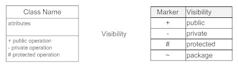
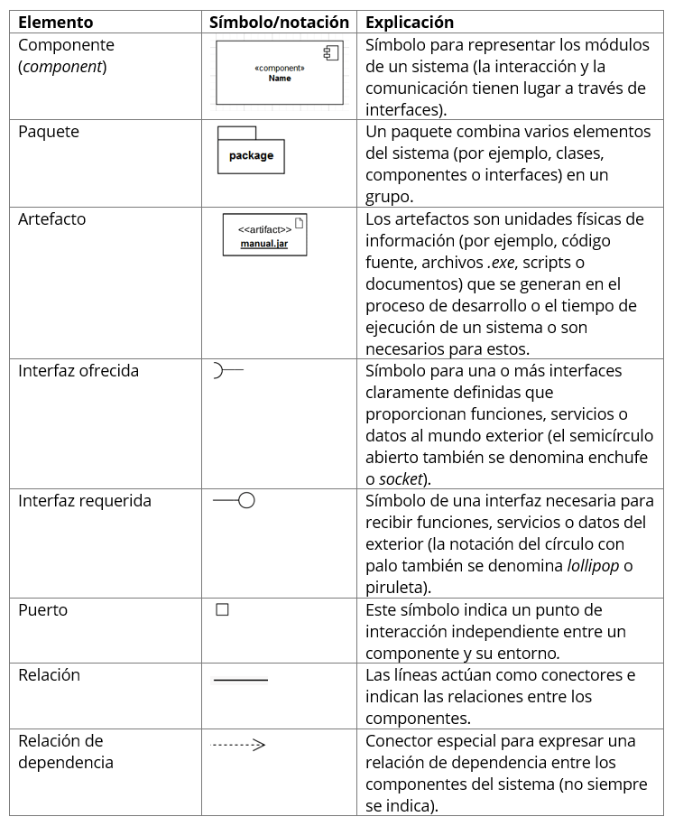
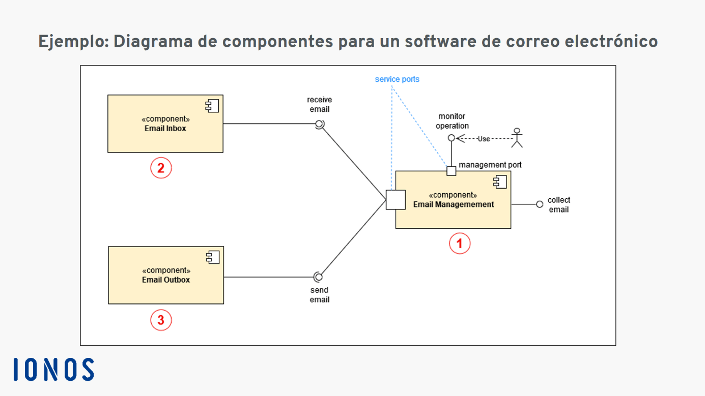

# Sesión 2.A - POO, Diagramas de Clases y Componentes

    Diplomado de Java - Módulo I
    Departamento de Diplomados y Extensión Profesional
    Centro de Investigación en Cómputo
    Instituto Politécnico Nacional

---

 Por [Alan Badillo Salas](https://github.com/dragonnomada)

---

## Introducción

En esta sesión revisaremos la teoría relacionada a la **Programación Orientada a Objetos**, los **Diagramas de Clases** y los **Diagramas de Componentes**.

Revisaremos los conceptos de la *programación orientada a objetos* que revisaremos serán el de *clase*, *objeto*, *atributo* y *método*.

Aprenderemos el modelado mediante los *diagramas de clases*, determinaremos la simbología estándar, los *métodos de acceso* y las relaciones de *dependencia de objeto* y de *herencia de clase*.

Por otro lado, también aprenderemos el uso de los *diagramas de componentes*, determinaremos la simbología estándar, las *interfaces de ofertas* y las *interfaces de requerimientos*.

## Programación Orientada a Objetos

El poder instruir a máquinas para cumplir objetivos, implica la implementación de algoritmos y pseudocódigos en lenguajes formales, para que la máquina entienda e interprete correctamente los pasos y procesos que necesita realizar para cumplir dichos objetivos. Esto es conocido como **la programación de la máquina**.

Según el tipo de máquinas, como computadoras por ejemplo, suelen disponer de múltiples lenguajes de programación de propósito general y también de propósito específico. En la modernidad se utilizan más los **lenguajes de programación de propósito general**. Ya que estos nos permiten resolver una gran cantidad de problemas, utilizando el mismo lenguaje.

Los **paradigmas de programación**, se refieren a la perspectiva y sentido que se le da al código generado y la forma en la que se modelan los problemas.

En la siguiente tabla podemos comparar los dos principales paradigmas de programación.

Paradigma | Modelo principal | Descripción
--- | --- | ---
Funcional | *Función o Proceso* | Establece que todos los problemas deberían ser resueltos mediante tareas programadas en funciones o procesos, que reciban una entrada y devuelvan una salida.
Orientado a Objetos | *Clases y Objetos* | Establece que todos los problemas deberían ser resueltos mediante entidades que absorban un estado interno y un las tareas posibles sobre estado (el objeto), con un diseño que permita entender la arquitectura de cada entidad (la clase).

Existen otros paradigmas, como los orientados a aspectos, orientados a eventos, programación modular, programación distribuída, etc. Pero principalmente se suelen utilizar los listados en la mayoría de lenguajes de programación de propósito general. Incluso algunos lenguajes soportan múltiples paradigmas de programación.

### Objetos

Los **objetos** son la pieza fundamental de la *programación orientada a objetos*. Estos **representan el conjunto de datos retenidos en el programa para una entidad en particular** (el estado de datos particular de una entidad). Dichos datos son aislados del resto de datos del programa y se consideran el estado de una entidad específica.

    Los objetos se componen de *atributos* y *métodos* que pueden ser accesibles desde dentro del objeto o desde fuera, según los niveles de acceso diseñados.

Pensemos por ejemplo, en un programa que está manipulando datos de personas. La entidad en cuestión será la `Persona`. Cada persona podrá retener datos que le describan, por ejemplo, el `nombre`, la `edad`, su `correo`, etc. A estos datos les llamaremos *los atributos de la entidad*. Sin embargo, la referencia física y lógica hacia los datos de una persona en particular, le llamaremos *el objeto de una Persona* o en términos informáticos *la instancia de una Persona*.

El objeto será la referencia a los datos de la entidad `Persona`, por ejemplo, el objeto `p1` se podría referir a los datos retenidos en el programa para una `Persona`, el objeto `p2` sería la referencia a los datos de otra `Persona` y así podríamos generar tantos objetos como deseemos, para retener cada conjunto de datos, para cada persona en particular. Si retuvieramos en memoria los datos de `1,000` personas, entonces necesitaríamos `1,000` objetos, cada uno reteniendo los datos de una persona en particular (su propio nombre, edad, correo, etc).

### Clases

Si vemos a los *objetos* como almacenes de datos de una entidad en particular, podríamos ver a las **clases** como el **diseño de una entidad en general**. Es decir, como el diseñador de cómo deberían generarse objetos de una entidad en general.

    Las clases nos permitirán modelar los objetos que serán construídos a través de dos tipos *miembros* que tendrá cada objeto. 
    
    Los *atributos* definirán los datos que conformarán cada objeto.

    Los *métodos* definirán las funciones que se podrán aplicar sobre cada objeto, para obtener, ajustar o procesar los atributos del objeto.

Se podría decir que la clase es el diseñador y el objeto es la construcción basada en el diseño. 

Por ejemplo, la clase de diseño puede determinar modelar objetos que sean moldeadoras de tornillos. Cada moldeadora de tornillos generará un tornillo específico. Entonces, la clase de diseño podría determinar las pulgadas de ancho de la cabeza (`anchoCabeza`), las pulgadas de ancho del cuerpo (`anchoCuerpo`), el lago de la cabeza (`lagoCabeza`), el largo del cuerpo (`largoCuerpo`), el número de ranuras por pulga que tendrá el cuerpo (`numRanuras`) y tipo de cabeza (`tipoCabeza`).

En la siguiente tabla se resumen los atributos para una clase (o entidad) capaz de moldear tornillos, llamada `MaquinaMoldeadoraTornillos`.

> Clase `MaquinaMoldeadoraTornillos` (Atributos)

Atributo | Tipo de Dato | Ejemplo | Descripción
--- | --- | --- | ---
`anchoCabeza` | Decimal | `1.5` | Ancho que tendrá la cabeza del tornillo
`anchoCuerpo` | Decimal | `0.5` | Ancho que tendrá el cuerpo del tornillo
`lagoCabeza` | Decimal | `0.1` | Largo que tendrá la cabeza del tornillo
`largoCuerpo` | Decimal | `0.8` | Largo que tendrá el cuerpo del tornillo
`numRanuras` | Entero | `16` | Número de vueltas que tendrá caben en una pulgada en el cuerpo del tornillo 
`tipoCabeza` | Texto | `Hexagonal` | Tipo de cabeza del tornillo, asociado a la llave utilizada para atornillarlo

La clase nos ayudará a mantener un modelo sólido sobre los datos retenidos por la entidad (**atributos**), para poder construir objetos específicos que retengan dichos datos. Sin embargo, también nos permitirá modelar las operaciones que podremos realizar sobre cada objeto particular, como recuperar los datos (`getters`), ajustar los datos (`setters`) o realizar operaciones en general (**métodos**).

Veamos algunos *métodos* que podríamos establecer sobre nuestra clase `MaquinaMoldeadoraTornillos`.

Ya sabemos que podemos diseñar máquinas para moldear tornillos. Existirán tantas máquinas posibles, como objetos con valores particulares creemos. Sin embargo, cada objeto (máquina moldeadora de tornillos en particular) podrá disponer de múltiples acciones (métodos) que se podrán aplicar sobre sus datos (atributos).

En la siguiente tabla se muestran algunos métodos aplicables a cada objeto definidos desde el diseño de la clase.

> Clase `MaquinaMoldeadoraTornillos` (Métodos)

Método | Parámetros de Entrada | Tipo de Salida | Aspecto | Descripción
--- | --- | --- | --- | ---
`obtnerAnchoCabeza` | - | Decimal | `Getter` | Devuelve el tamaño del ancho de la cabeza del tornillo
`obtnerAnchoCuerpo` | - | Decimal | `Getter` | Devuelve el tamaño del ancho del cuerpo del tornillo
`obtnerLagoCabeza` | - | Decimal | `Getter` | Devuelve el tamaño del largo de la cabeza del tornillo
`obtnerLargoCuerpo` | - | Decimal | `Getter` | Devuelve el tamaño del largo del cuerpo del tornillo
`obtnerNumRanuras` | - | Entero | `Getter` | Devuelve el número de ranuras que caben en una pulgada en el cuerpo del tornillo
`obtnerTipoCabeza` | - | Texto | `Getter` | Devuelve el tipo de cabeza del tornillo
`ajustarAnchoCabeza` | `anchoCabeza` | - | `Setter` | Ajusta el nuevo valor al dado mediante `anchoCabeza`
`ajustarAnchoCuerpo` | `anchoCuerpo` | - | `Setter` | Ajusta el nuevo valor al dado mediante `anchoCuerpo`
`ajustarLagoCabeza` | `largoCabeza` | - | `Setter` | Ajusta el nuevo valor al dado mediante `largoCabeza`
`ajustarLargoCuerpo` | `largoCuerpo` | - | `Setter` | Ajusta el nuevo valor al dado mediante `largoCuerpo`
`ajustarNumRanuras` | `numRanuras` | - | `Setter` | Ajusta el nuevo valor al dado mediante `numRanuras`
`ajustarTipoCabeza` | `tipoCabeza` | - | `Setter` | Ajusta el nuevo valor al dado mediante `tipoCabeza`
`describirMáquina` | - | Texto | `Descriptor` | Devuelve un texto que describe la máquina moldeadora de tornillos
`producirTornillos` | `numTornillos` | - | `Function` | Produce tantos tornillos como los específicados en la entrada `numTornillos`.

Podemos ver que los métodos contienen diferentes aspectos, por ejemplo, ser `Getter` (adquisitores de datos de los atributos del objeto), ser `Setter` (ajustadores de datos a los atributos del objeto), ser `Descriptor` (descriptores del objeto) o ser `Function` (funciones generales sobre el objeto).

Cada aspecto es una forma humana de entender los métodos en cuestión, pero en fines prácticos esto no es relevante. Basta con saber cuáles son los parámetros de entrada que necesita el método para funcionar sobre el objeto y el tipo de salida esperada.

Por ejemplo, los métodos tipo `getter` se centran en devolvernos la información sobre los datos retenidos en los atributos del objeto, los métodos tipo `setter` nos permiten actualizar los datos de los atributos del objeto, los métodos tipo `descriptor` nos permiten describir en forma compacta el objeto (podría ser Texto o Bytes para mostrarle la información del objeto al humano o serializarla para un archivo). Finalmente los métodos de tipo `Function` serán funciones generales, que podrán o no acceder a los atributos del objeto, modificándolos o no. Estos sirven en general para procesar los datos del objeto en formas personalizadas. 

En nuestro ejemplo el método `producirTornillos` podría comenzar a producir tornillos a una máquina real. Entonces, cada objeto que mande a llamar a dicho método hará el procesamiento necesario para conseguirlo.

### Atributo

Los **atributos** son especificaciones sobre los datos que podrán ser retenidos en cada objeto. La clase utiliza la especificación de cada atributo para permitirle al objeto en particular, retener esos datos en forma de variables. El atributo también especifica el nivel de acceso que tendrá el objeto desde afuera y desde clases derivadas, como veremos en temas posteriores de encapsulamiento, polimorfismo y herencia.

### Método

Los **métodos** son especificaciones sobre procesos que pueden ser aplicados al objeto (en forma de funciones). Estos se implementan como funciones que reciben parámetros de entrada devuelven una salida (opcionalmente ya que se puede usar `void` para especificar que el método no devuelve nada). Los métodos pueden verse como funciones con acceso a los atributos y otros métodos del objeto. Por lo que podemos crear componentes ricos en relaciones y procesamiento de tareas y rutinas.

Por ejemplo, un objeto capaz de retener los datos de una persona (atributos de la persona) y realizar diversas acciones u operaciones con esos datos (métodos de la persona). Así la persona podría tener un correo electrónico en sus datos (atributo `correo`) y la capacidad de enviarle un correo de saludo (método `enviarSaludoPorCorreo(mensaje) -> Booleano`), dónde en este último método, podemos definir qué tipo de parámetros necesitara el objeto desde afuera para funcionar (`mensaje` de tipo `Texto` con el contenido del saludo) y qué tipo de respuesta nos devolverá (un `Booleano`, que será un `true` o `false` si pudo lograr enviar el mensaje).

#### Ejercicio 3.1

* Responde las siguientes preguntas con tus propias palabras (no usar definiciones de libros, internet o estas mismas notas).
    - ¿Qué es una clase?
    - ¿Qué es un objeto?
    - ¿Qué es un atributo?
    - ¿Qué es un método?
    - ¿Cuál es la diferencia entre una clase y un objeto?
    - ¿Cuál es el límite de objetos permitidos por una clase?
    - ¿Cuál es el límite de atributos permitidos por una clase?
    - ¿Cuál es el límite de métodos permitidos por una clase?
    - ¿Qué diferencia hay entre el atributo de una clase y el atributo en un objeto?
    - ¿Qué diferencia hay entre el método de una clase y el atributo en un objeto?
    - ¿Para qué serviría una clase que no tenga métodos definidos?
    - ¿Para qué serviría una clase que no tenga atributos definidos?
* Modela tres clases distintas con sus atributos y métodos como en las tablas anteriores.

## Diagramas de Clases

Los **Diagramas de Clases** nos permiten modelar clases y las relaciones entre otras clases y objetos de forma esquemática. Estos consisten en una serie de símbolos estandarizados para definir correctamente los atributos y nivel de acceso, los métodos con sus parámetros de entrada, la salida esperada y su nivel de acceso. También algunas relaciones de herencia y dependencia de objetos.

En la siguiente figura podemos ver un resumen de estos símbolos para los **Diagramas de Clases UML** (`UML` - Lenguaje de Modelado Unificado).

> Figura 3.1 - Modelado de clases

Una clase es modelada como una caja dividida en tres secciones, la primer sección contendrá el nombre de la clase (relacionada a la entidad). La segunda sección describirá una lista de todos los atributos de la clase con el formato `<acceso> <nombre> : <tipo>`, dónde el tipo de dato es algo opcional, pero que lo vuelve más descriptivo. Finalmente en la tercer sección se listarán todos los métodos (o acciones / operaciones) determinadas por la clase sobre los objetos.

> EJEMPLO: Clase MaquinaMoldeadoraTornillos

    +----------------------------------------------------+
    | MaquinaMoldeadoraTornillos                         |
    +----------------------------------------------------+
    | [-] anchoCabeza : Decimal                          |
    | [-] anchoCuerpo : Decimal                          |
    | [-] lagoCabeza  : Decimal                          |
    | [-] largoCuerpo : Decimal                          |
    | [#] numRanuras  : Entero                           |
    | [+] tipoCabeza  : Texto                            |
    +----------------------------------------------------+
    | [+] obtnerAnchoCabeza  : () -> Decimal             |
    | [+] obtnerAnchoCuerpo  : () -> Decimal             |
    | [+] obtnerLagoCabeza   : () -> Decimal             |
    | [+] obtnerLargoCuerpo  : () -> Decimal             |
    | [+] obtnerNumRanuras   : () -> Entero              |
    | [+] obtnerTipoCabeza   : () -> Texto               |
    | [-] ajustarAnchoCabeza : (anchoCabeza) -> *        |
    | [-] ajustarAnchoCuerpo : (anchoCuerpo) -> *        |
    | [-] ajustarLagoCabeza  : (lagoCabeza)  -> *        |
    | [-] ajustarLargoCuerpo : (largoCuerpo) -> *        |
    | [-] ajustarNumRanuras  : (numRanuras)  -> *        |
    | [-] ajustarTipoCabeza  : (tipoCabeza)  -> *        |
    | [+] describirMáquina   : () -> Texto               |
    | [#] producirTornillos  : (numTornillos) -> *       |
    +----------------------------------------------------+

En el diagrama podemos observar la presencia de `[+]`, `[-]` y `[#]` que son los niveles de acceso de los miembros a público, privado y protegido, respectivamente. Estos niveles de acceso se revisarán posteriormente, sin embargo, a grandes rasgos significan que dichos miembros (atributos o métodos) pueden ser accedidos desde fuera del objeto (es público), sólo desde adentro del objeto (es privado) o desde dentro del objeto o algún objeto derivado mediante herencia (está protegido).

> Figura 3.2 - Modelado de relaciones entre clases

Las clases se pueden relacionar mediante **Asociaciones**, que signfica que una clase está asociada a otra (flecha simple `-->`) o heredada (flecha con terminación en triángulo `-->>`). Este tipo de relación se conoce como asociación, ya que indica que una clase puede ser accedida desde otra clase, es decir, un objeto tendrá acceso a los miembros de otra clase, generalmente por herencia o implementación de interfaces o clases abstractas. La diferencia entre una asociación simple (`-->`) y una marcada (`-->>`) será el medio de acceso, que podría significar que desde una clase se accede a otra por relación de algún atributo (asociación simple) o por herencia (asociación marcada).

Otro tipo de relaciones entre las clases se da mediante la relación de **agregación** (flecha con terminación en rombo vacío `--<>`) que significa que la clase posee la referencia a un objeto de otra clase, es decir, la clase primaria (`A`), posee un objeto de la clase secundaria (`B`). Si se desea hacer una operación sobre el objeto de la clase secundaria (`B`) se podría lograr hacer desde la clase primaria (`A`). 

Por ejemplo, supongamos que existe la clase `Venta` y esta tiene la referencia a la clase `Vendedor` y la referencia a la clase `Cliente`, entonces podemos definir una relación de agregación sobre `Venta` hacía `Vendedor` y otra relación de agregación sobre `Venta` hacía `Cliente`. Ya que una venta contiene la referencia a un objeto de `Vendedor` y la referencia hacía algún objeto de `Cliente`.

> EJEMPLO: Relaciones de **Agregación** entre `Venta`, `Vendedor` y `Cliente`

    [Venta] ──<> [Vendedor]
        └─────<> [Cliente]

También existe otro tipo de relaciones entre clases llamada **composición** (flecha con terminación en rombo relleno `--<+>`), y se da cuando la clase primaria (`A`) es quién creó el objeto de la clase secundaria (`B`), es decir, es el único con la referencia al objeto de la otra clase.

Por ejemplo, cuándo una clase llamda `Paquete` genera un objeto llamado `Acuse` y otro objeto llamado `Guia`, los cuales servirán para enviar el paquete. Entonces, estas relaciones serán de *composición* ya que los objetos serán administrados por la clase `Paquete`, es decir, todo lo que les ocurra al `Acuse` y la `Guia` será a través de `Paquete`. Un objeto `Acuse` no existirá fuera de un `Paquete`, tampoco un objeto `Guia`.

> EJEMPLO: Relaciones de **Composición** entre `Paquete`, `Acuse` y `Guia`

    [Paquete] ──<+> [Acuse]
        └───────<+> [Guia]

Con estos diagramas podemos modelar clases, las relaciones entre las clases y las relaciones entre sus objetos.

### Ejercicio 3.2

* Responde las siguientes preguntas con tus propias palabras (no usar definiciones de libros, internet o estas mismas notas).
    - ¿Qué diferencia hay entre las relaciones de asociación y las relaciones de agregación y composición?
    - En una relación de agregación entre la clase primaria y la clase secundaria, ¿Puede existir un objeto de la clase secundaria fuera de la clase primaria?
    - En una relación de composición entre la clase primaria y la clase secundaria, ¿Puede existir un objeto de la clase secundaria fuera de la clase primaria?
* Crea los diagramas de clases para un sistema de ventas considerando los siguientes puntos y procesos.
    - Una venta se refiere a un evento en el cuál hay un monto total vendido, una lista de productos asociados, un acuse para abrir la venta por parte de un vendedor, un acuse para confirmar la venta por parte de un cliente, un acuse para cerrar la venta por parte de un vendedor, un acuse para recibir los productos de la venta por parte de un servicio de entrega, un acuse para confirmar la recepción de los productos entregados por parte de un cliente, un acuse para confirmar la entrega por parte de un vendedor, un acuse para completar la venta por parte del sistema y una guia de transporte para entregar los productos de la venta al servicio de entrega.
    - El vendedor se refiere a un empleado físico o virtual (punto de venta) capaz de firmar los acuses que se le soliciten.
    - El cliente se refiere a un cliente físico o virtual (plataforma de venta) capaz de firmar los acuses que se le soliciten.
    - El servicio de entrega se refiere a una empresa física o virtual (paquetería) capaz de recibir una guía de venta y firmar los acuses que se le soliciten.

## Diagramas de Componentes

Los **Diagramas Componentes** permiten modelar el funcionamiento del sistema a través de procesos y transferencia de datos entre las entidades (generalmente clases).

El componente lo entenderemos como un objeto capaz de entregar datos (`interfaz de oferta`) y capaz de recibir datos (`interfaz de requerimiento`). En estas notas no manejaremos símbolos adicionales como paquetes y demás, a menos que haga falta, y en su momento se explicarán más a detalle.

En la siguiente figura podemos ver los diferentes símbolos que componenen un diagrama de componentes.

> Figura 3.3 - Símbolos de los diagramas de componentes

Los símbolos que utilizaremos son el de **Componente**, el de **Interfaz ofrecida**, la **Interfaz requerida** y el **Puerto**. Los demás símbolos no serán utilizados en estas notas.

El **Componente** representará el objeto que interactua en el sistema.

La **Interfaz ofrecida** será la comunicación o relación de los datos que saldrán del componente y se conectarán hacía otro componente.

La **Interfaz requerida** será la comunicación o relación de los datos que entrarán al componente y desde otro componente.

El **Puerto** será la forma en la que se determinará una salida o entrada de datos.

En la siguiente figura podemos ver un ejemplo de un diagrama de componentes para un sistema de correo electrónico.

> Figura 3.4 - Ejemplo de un diagrama de componentes para un sistema de correo electrónico

Cómo podemos observar en el diagrama existen tres componentes.

1. El administrador del correo
2. Los correos en la bandeja de entrada
3. Los correos en la bandeja de salida

Para entender los diagramas de componentes, es importante ejercitar leerlos describiendo las relaciones de oferta y requerimiento entre los componentes. Veamos la explicación leída del ejemplo.

    El [Sistema de Correo] requiere recolectar los datos del correo electrónico que estará administrando, estos datos podrían ser, el correo, la contraseña, el protocolo de mensajería, el nombre del usuario, etc. 
    
    El componente [Sistema de Correo] ofrecerá los datos sobre el correo, para poder obtener la lista de correos en la bandeja de entrada y la lista de correos en la bandeja de salida.

    El componente [Bandeja de Entrada] requiere los datos de correo, y quizás datos que permitan filtrar los correos por fecha o búsquedas específicas, esta comunicación permitirá conectar la bandeja de entrada con el sistema de administración de correo y devolverle la lista de correo en la bandeja de entrada.

    El componente [Bandeja de Salida] requiere los datos de correo, y quizás datos que permitan filtrar los correos por fecha o búsquedas específicas, esta comunicación permitirá conectar la bandeja de salida con el sistema de administración de correo y devolverle la lista de correo en la bandeja de salida.

Como podemos observar, la descripción de los tres componentes, permite establecer las relaciones entre los componentes y entender los requerimientos de datos del componente (`Interfaz requerida`) y los datos que ofrece el componente (`Interfaz ofracida`).

De esta manera podremos modelar la trasacción de datos entre componentes y determinar si se podrían reemplazar algunos componentes por otros, sin tener una pérdida de datos y generalidad.

### Ejercicio 3.3

* Responde las siguientes preguntas con tus propias palabras (no usar definiciones de libros, internet o estas mismas notas).
    - ¿Que representa un `Componente`?
    - ¿Que representa una `Interfaz Requerida`?
    - ¿Que representa una `Interfaz Ofrecida`?
    - ¿Es posible reemplazar un componente por otro y qué necesitaríamos?
    - ¿Importa de donde vienen los datos de la `Interfaz ofrecida`?
    - ¿Importa hacía donde van los datos de la `Interfaz requerida`?
* Diseña el diagrama de componentes para el sistema de ventas propuesto en la sección anterior.