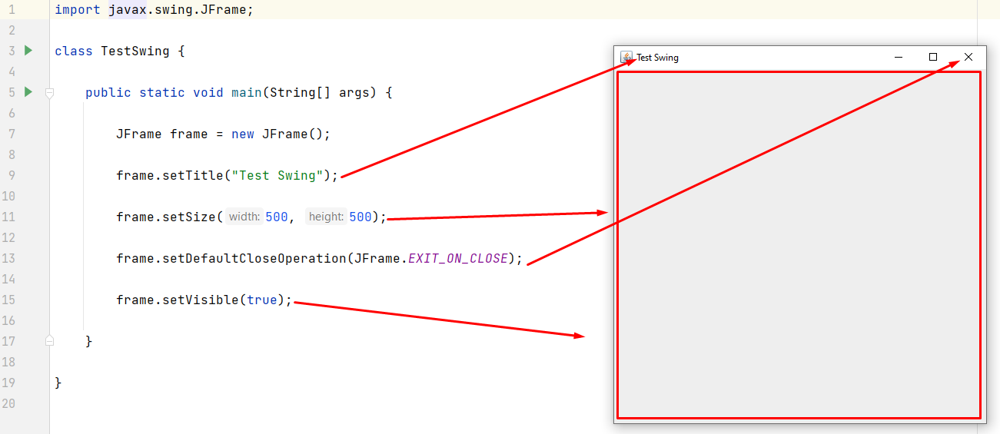
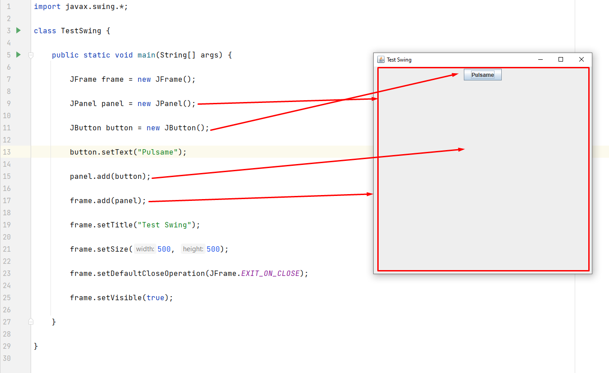

# Taller 2 - Aplicaciones de Swing

## Conceptos

### 1. La librería de Swing

La librería de `javax.swing.*` contiene las clases necesarias para construir componentes gráficos e interfaces
de usuario. Esta se apoya de la librería `java.awt.*` para el manejo de eventos en las interfaces de usuario.

Algunas clases importantes son:

| Clase        | Descripción                                     |
|--------------|-------------------------------------------------|
| `JFrame`     | Construye una ventana                           |
| `JPanel`     | Construye un panel que puede añadir componentes |
| `JButton`    | Construye un botón                              |
| `JLabel`     | Construye una etiqueta de texto                 |
| `JTextField` | Construye una caja de texto                     |

### 2. Construir una ventana

Para generar una venta basta con crear una instancia de `JFrame` y ajustar sus propiedades.

Las principales propiedades de `JFrame` son:

| Propiedad                                            | Efecto                                                                                         |
|------------------------------------------------------|------------------------------------------------------------------------------------------------|
| `add(<componente>)`                                  | Agrega un componente a la ventana                                                              |
| `add(<componente, BorderLayout.<ORIENTATION>)`       | Agrega el componente en una posible dirección (`NORTH, `SOUTH`, `WEST`, `EAST`, `CENTER`, ...) |
| `setTitle(<título>)`                                 | Establece el título de la ventana                                                              |
| `setSize(<ancho>, <alto>)`                           | Especifica el ancho y alto de la ventana                                                       |
| `setDefaultCloseOperation(JFrame.<CLOSE_OPERATION>)` | Determina que ocurre cuándo el usuario pulsa el botón de cerrar de la ventana                  |
| `setVisible(<true/false>)`                           | Muestra o esconde la ventana (por defecto está escondida)                                      |

> Ejemplo de una ventana simple:

```java
import javax.swing.JFrame;

class TestSwing {

    public static void main(String[] args) {
        
        JFrame frame = new JFrame();
        
        frame.setTitle("Test Swing");
        
        frame.setSize(500, 500);
        
        frame.setDefaultCloseOperation(JFrame.EXIT_ON_CLOSE);
        
        frame.setVisible(true);
        
    }
    
}
```



### 3. Construir y agregar componentes

Los componentes son objetos derivados de `JComponent` como el `JButton`, el `JLabel`, el `JTextField`, etc.

Los componentes pueden ser añadidos a la ventana directamente o a paneles.

Un panel se genera con `JPanel` y se puede agregar a la ventana o a otro panel, creando así jerarquías visuales.

> Ejemplo: Construir una venta, un panel y un botón

```java
import javax.swing.*;

class TestSwing {

    public static void main(String[] args) {

        JFrame frame = new JFrame();
        
        JPanel panel = new JPanel();
        
        JButton button = new JButton();
        
        button.setText("Pulsame");
        
        panel.add(button);
        
        frame.add(panel);

        frame.setTitle("Test Swing");

        frame.setSize(500, 500);

        frame.setDefaultCloseOperation(JFrame.EXIT_ON_CLOSE);

        frame.setVisible(true);

    }

}
```



### 4. Controlar los eventos de los componentes

Según el componente, algunos tendrán definido un `Listener` derivado de alguna interfaz o clase abstracta listener,
y esta representa qué deberíamos controlar cuándo un evento ocurra.

Por ejemplo, el `JButton` define un `ActionListener` que determina lo que ocurrirá al pulsar el botón. Si creamos
una implementación de `ActionListener` formal o informal, esta será capaz de controlar el evento.

> Ejemplo: Un `ActionListener` formal

```java
import javax.swing.*;
import java.awt.event.ActionEvent;
import java.awt.event.ActionListener;

class ControladorBoton implements ActionListener {

    private int contador = 0;
    
    @Override
    public void actionPerformed(ActionEvent e) {
        System.out.printf("Contador: %d\n", contador++);
    }
}

class TestSwingActionListenerFormal {
    
    public static void main(String[] args) {

        JFrame frame = new JFrame();
        JPanel panel = new JPanel();
        
        JButton button = new JButton("Pulsame");
        
        ControladorBoton controlador1 = new ControladorBoton(); // Crea un controlador
        
        button.addActionListener(controlador1); // Determinar llamar al controlador cada que el botón se pulse

        panel.add(button);
        frame.add(panel);
        
        frame.setTitle("Test Swing");
        frame.setSize(500, 500);
        frame.setDefaultCloseOperation(JFrame.EXIT_ON_CLOSE);
        frame.setVisible(true);

    }
    
}
```


> Ejemplo: Un `ActionListener` informal

```java
import javax.swing.*;
import java.awt.event.ActionEvent;
import java.awt.event.ActionListener;

class TestSwingActionListenerInformal {
    
    public static void main(String[] args) {

        JFrame frame = new JFrame();
        JPanel panel = new JPanel();
        
        JButton button = new JButton("Pulsame");
        
        button.addActionListener(new ActionListener() {

            private int contador = 0;

            @Override
            public void actionPerformed(ActionEvent e) {
                System.out.printf("Contador: %d\n", contador++);
            }
            
        }); // Determinar llamar al controlador cada que el botón se pulse

        panel.add(button);
        frame.add(panel);
        
        frame.setTitle("Test Swing");
        frame.setSize(500, 500);
        frame.setDefaultCloseOperation(JFrame.EXIT_ON_CLOSE);
        frame.setVisible(true);

    }
    
}
```
